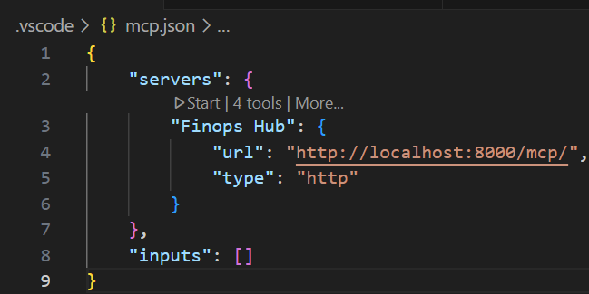
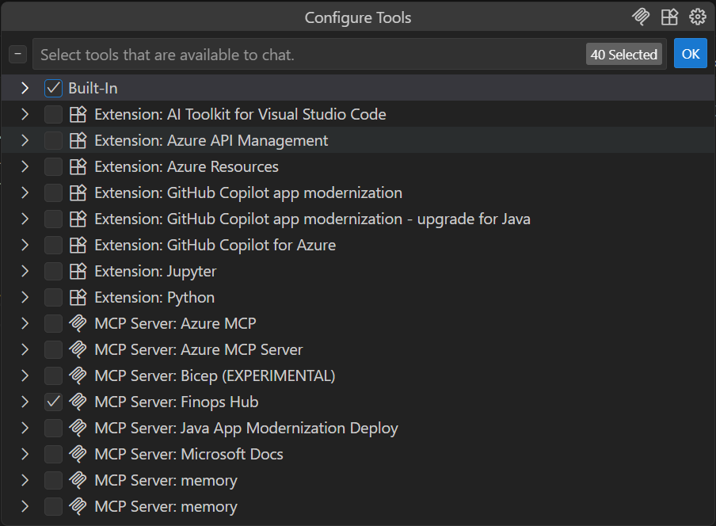
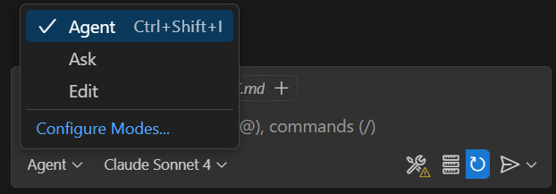
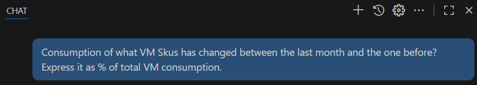
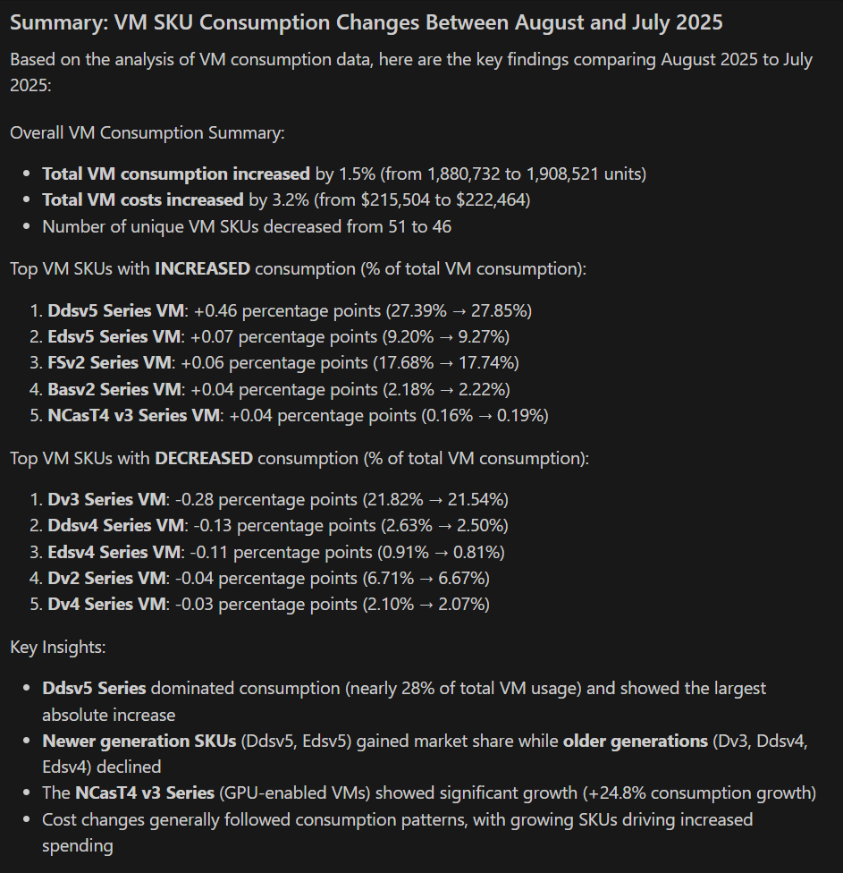

# FinOps Hub MCP Server

## Overview

This Model Context Protocol (MCP) server provides intelligent access to Financial Operations (FinOps) data and insights through Azure Data Explorer (ADX), enabling AI assistants to help organizations optimize their cloud spending and operational efficiency.

## FinOps and Azure Data Explorer as a Data Warehouse Foundation

**Financial Operations (FinOps)** is a cultural practice and operational framework that brings financial accountability to the variable spend model of cloud computing. It enables organizations to get maximum business value by helping engineering, finance, technology, and business teams collaborate on data-driven spending decisions.

[**Azure FinOps Hub**](https://microsoft.github.io/finops-toolkit/hubs), part of the [**Azure FinOps Toolkit**](https://microsoft.github.io/finops-toolkit), is a **centralized analytics solution** for implementing FinOps practices at scale. Built on **Azure Data Explorer (ADX)**, it ingests, processes, and organizes cost and usage data across **multiple Azure subscriptions and cloud providers**.  

The Hub provides a consistent, extensible data model and a high-performance query layer, enabling teams to drive **cost management, optimization, and governance** with greater speed and accuracy.


**Azure Data Explorer (ADX)** serves as the ideal data warehouse foundation for FinOps operations because:

- **Real-time Analytics**: ADX provides lightning-fast query performance on large volumes of cost and usage data
- **Time-series Optimization**: Native support for time-based analysis, perfect for cost trending and forecasting
- **Scalable Architecture**: Handles petabytes of billing data across multiple subscriptions and cloud providers
- **Advanced Analytics**: Built-in machine learning capabilities for anomaly detection and predictive analytics
- **Integration Ready**: Seamless connection to Azure services and third-party cost management tools

The combination of FinOps practices with ADX as the analytical engine creates a powerful platform for continuous cost optimization, enabling organizations to make informed financial decisions in real-time.

## What This MCP Server Can Do For You

This MCP server acts as an intelligent bridge between AI assistants and your FinOps data warehouse, providing the following capabilities:

### 🔍 **Intelligent Query Suggestions**
- **Smart Recommendations**: Get contextually relevant KQL (Kusto Query Language) queries based on your specific FinOps questions
- **Purpose-driven Queries**: Describe what you want to analyze (e.g., "cost optimization opportunities") and receive pre-built queries
- **Keyword-based Discovery**: Find relevant queries using natural language keywords

### 📊 **Direct Query Execution**
- **KQL Query Engine**: Execute custom Kusto queries directly against your FinOps Hub data
- **Real-time Results**: Get immediate access to cost and usage data in structured DataFrame format
- **Error Handling**: Robust error management with detailed feedback for query debugging

### 💰 **Azure Advisor Integration** (Experimental, WIP)
- **Cost Recommendations**: Retrieve Azure Advisor recommendations for specific resources or entire subscriptions
- **Optimization Insights**: Get actionable advice on reducing costs and improving resource efficiency
- **Resource-specific Guidance**: Filter recommendations by resource group or individual resources

### 📈 **VM Performance Monitoring** (Experimental, WIP)
- **CPU Utilization Metrics**: Monitor virtual machine performance with detailed CPU utilization data
- **Resource Optimization**: Identify over-provisioned or under-utilized virtual machines
- **Performance Correlation**: Connect performance metrics with cost data for informed rightsizing decisions

## Getting Started

This MCP server integrates with AI assistants that support the Model Context Protocol, providing them with the ability to intelligently query and analyze your FinOps data. Configure your Azure credentials and FinOps Hub connection to start leveraging AI-powered financial operations insights.

## Installation and Setup

### Prerequisites

Before running the FinOps Hub MCP Server, ensure you have the following installed:

- **MCP client of your choice**: e.g. GitHub Copilot
- **Python 3.10+**: Required for running the MCP server
- **Docker**: Needed to run Weaviate vector database
- **Azure CLI**: For authentication with Azure services
- **Git**: To clone the repository

### Install Python Dependencies

```bash
pip install -r requirements.txt
```

### Configure environment variables

1. **Create environment file**: 
   - Copy `.env.example` to `.env` in your project root directory
   - This file will contain your sensitive configuration settings

2. **Configure Azure OpenAI settings**:
   Update the following values:
   - `AZURE_OPENAI_ENDPOINT=` *Replace with your Azure OpenAI resource endpoint (e.g., https://your-resource.openai.azure.com/)*
   - `AZURE_OPENAI_API_KEY=` *Replace with your Azure OpenAI API key*
   - `AZURE_OPENAI_CHAT_DEPLOYMENT_NAME=gpt-4o` *(or your preferred chat model deployment)*
   - `AZURE_OPENAI_EMBEDDING_DEPLOYMENT_NAME=text-embedding-ada-002` *(or your embedding model deployment)*

3. **Configure FinOps Hub Kusto cluster**:
   - `FINOPS_HUB_CLUSTER=` *Replace with your Azure Data Explorer cluster URL (e.g., https://your-cluster.kusto.windows.net)*

4. Since the server run locally and leverages default credentials, make sure to log in using **az cli** with an account that has access to the FinOps Hub ADX Databases.
    ```bash
    az login
    ```

### Setting Up Weaviate Vector Database

1. **Start Weaviate with Docker**:
    ```bash
    docker run -d --name weaviate -p 8080:8080 -p 50051:50051 cr.weaviate.io/semitechnologies/weaviate:latest
    ```

    Verify Weaviate is running by vising http://localhost:8080/v1/meta

### Content Parsing and Injection

2. **Inject Query examples**:
    ```bash
    python server/parser.py inject
    ```

    Verify if the index has been properly populated by visiting http://localhost:8080/v1/objects

### Running the MCP Server

```bash
python server/server.py
```

The server will start and be ready to accept MCP protocol connections from AI assistants.

### Using the MCP server from GitHub Copilot

1. Open ghc-workspace folder in Visual Studio code

2. Open .vscode/mcp.json and start the server 
, make sure the start is successful.

3. Configure MCP servers available for the workspace, select the Finops Hub




Make sure to select only the required range of instruments to make certain Copilot is not confused.

4. Switch GitHub Copilot Chat to agent mode 


5. Go ahead and ask something about your cost and consumption data.





### Updating the sample library from the dashboard definition ###

1. **Download the latest dashboard definition**:

Obtain the recent [ADX dashboard definition](https://github.com/microsoft/finops-toolkit/releases/latest/download/finops-hub-dashboard.json) and store it in the content folder.

2. **Parse and index the dashboard queries**:
    ```bash
    python server/parser.py parse
    python server/parser.py index
    ```
---

*Transform your cloud financial management with AI-powered FinOps insights through Azure Data Explorer.*